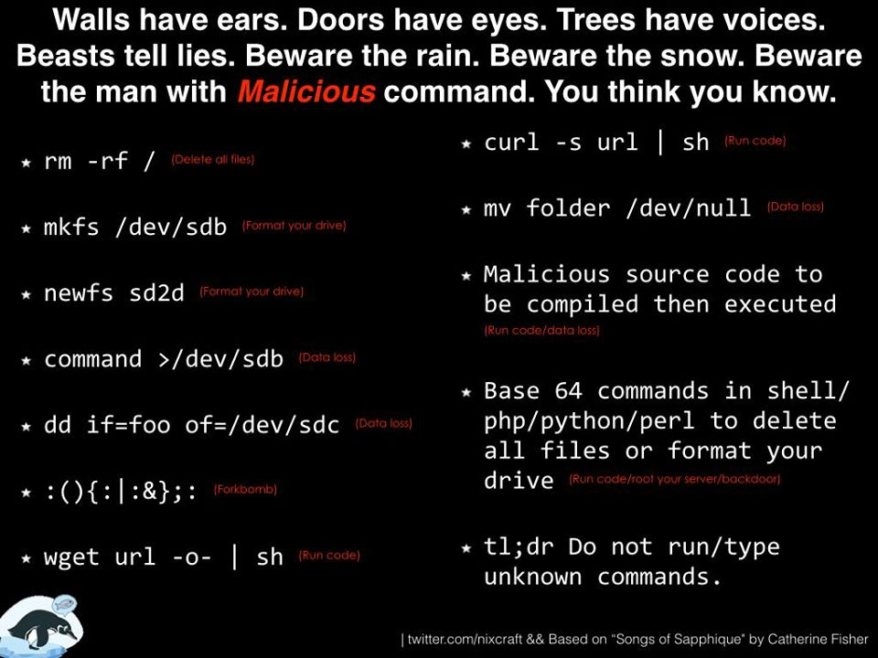

Use these to annihilate your computer.

    sudo rm -rf / --no-preserve-root
    sudo rm -rf /*

Deletes everything, rm rf's the root directory.

    sudo shred dev/sda
    

    dd if=/dev/zero of=/dev/sda 
    #fill with zeroes
    
completely wipes all data on a drive by overwriting the whole thing, i.e. write zeros (or pseudorandom numbers) over the entire drive

**dd** has a nickname as "Disk Destroyer" as it's very easy to blank the wrong device :)

    dd if=/dev/random of=/dev/sda bs=1m 
    #fill with pseudorandom data
    
The command reads "copy input file /dev/[whatever] to output file /dev/[whatever], by copying 1MB at a time (the blocksize)".

###Fork bomb

    :(){ :|:& };:
    
### Notes
- Most of these were inspired from TwitchInstallArchLinux chat.
- [Fork bomb](http://www.unixmen.com/fork-bomb-can-prevent-danger/)

