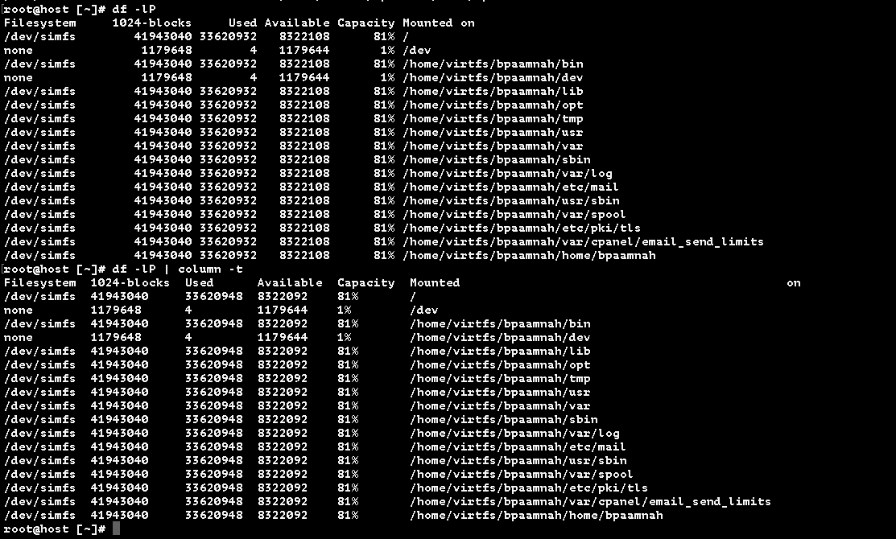

    df -h
  
The `-h` flag is for human readable output, show 30G instead of 30830588.

### Summing numbers in the output of `df`
We can do that by pip the output of the df command to something like awk and have awk sum up the numbers, like so:

    df -lP | awk '{}'
    df -lP | awk '{do math} END {print result}'

If the device names are long, df splits the output on multiple line to fit it in the normal 80 character long terminal. `-P` is for portability, use the POSIX output format (and not try to fit everything in by breaking lines) Get the foramt data in a consistent format, every device on one line.

FYI: You can also get a nicer output y piping the output to `column`

    df -lP | column -t
(To me it just looks like `column -t` right aligned the column data..)

So, back to summing..

    df -lP | awk '{sum += $3}'

the `sum` variable is equal to the sum of values in the third column `$3` (take the value of sum and add the third column to it).

    df -lP | awk '{sum += $3} END { printf sum }`

Get the sum and and at the end of it, print the value of `sum`.

    df -lP | awk '{sum += $3} END { printf "%d GiB\n", sum/2^20}`

---
https://www.youtube.com/watch?v=oBZ1-E_NcMg
https://www.dropbox.com/s/fe0w18o190z8mh1/Screenshot%202015-11-21%2009.44.52.png?dl=0