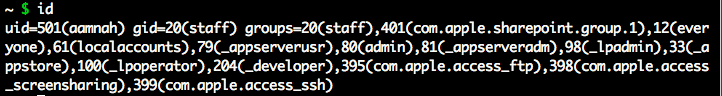

Process data and Ownership data in Linux use UIDs exclusively. 

This can create diffculties if a user is deleted while he still owns files in the filesystem. His UID can perhaps be assigned to a different user, and that user will inherit the previous UID owners files.

There is no technical problem with assigning the same numerical UID to different usernames but these users will have equal access to the files owned by that numeric UID. Don't do it if you don't have to.

We can find out an account id with 
  
    id

id for root and grumpyolme on a debian system

id for aamnah on a Mac OS X system

id will give you the

- user id `id -u username`
- group id `id -g username`
- other groups the user is a member of `id -G username`. similar to `groups username`

**root's UID is always 0**. that's how you determine if the user is root in bash scripts..