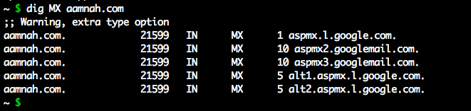

`whois aamnah.com` will return domain registration details for aamnah.com, including when it was registered, who registered it, when it was created and who is the contact.

`dig` is another useful command. You can use the `dig +short` to only list values.

## Name Servers

    whois aamnah.com | grep -i --color "Name Server:"
OR

    dig NS aamnah.com

## NS, TXT, MX, SOA, SPF records
You can either pass the record as an argument

    dig MX aamnah.com

or use `grep` to find it in the output of `dig`

    dig aamnah.com | grep --color "MX"

## Get technical contact for a domain

    whois aamnah.com | grep -i --color "Tech Name:\|Tech Phone:\|Tech Email:"
    

## Creation and Expiry dates

    whois aamnah.com | grep -i --color "Creation date:\|Expiration date:"
    
